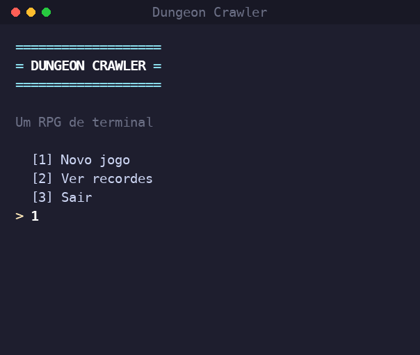

<div align="center">

# ⚔️ Dungeon Crawler

**A terminal RPG written in pure Python.**

Create a hero, pick a class, and battle your way through dungeons full of
monsters — gain experience, level up, collect loot, and defeat the Ancient Dragon.

[](https://www.python.org/)
[](#%EF%B8%8F-tech)
[](#-how-to-play)
[](LICENSE)


<br>



</div>

---

## 🎮 How to play

You only need **Python 3** — no installs, no dependencies.

```bash
python3 main.py
```

From the main menu you can start a **new game**, **continue** a saved run, or
check the **leaderboard**. Pick a name, a class, and a difficulty — then dive in.

---

## 🧙 Classes

| Class | Role | Abilities |
|------|------|-----------|
| 🛡️ **Warrior** | Tanky bruiser | Golpe Poderoso · Investida *(stun)* |
| 🔮 **Mage** | Glass cannon | Bola de Fogo · Raio Congelante *(stun)* |
| 🏹 **Archer** | Balanced ranged | Tiro Certeiro · Chuva de Flechas |
| ✨ **Paladin** | Sturdy healer | Luz Curativa · Martelo Sagrado *(stun)* |
| 🗡️ **Rogue** | Crit & poison | Golpe Sombrio *(poison)* · Apunhalar |

---

## ✨ Features

| System | What it does |
|--------|--------------|
| ⚔️ **Turn-based combat** | Attack, special abilities, defend, flee or use potions |
| 🎯 **Hit & crit rolls** | Attacks can miss or land critical hits |
| ☠️ **Status effects** | Poison (damage over time) and stun (skip a turn) |
| 📈 **Leveling** | Earn XP and gold, grow stronger every level |
| 🎒 **Inventory & gear** | Equip weapons and armor; manage your bag |
| 🪄 **Enchantments** | Gear with extra effects: +crit, +accuracy, poison-on-hit, regen |
| 🏪 **Shop** | Spend gold between stages — buy and sell items |
| 🎲 **Random events** | Chests, traps, fountains and a mysterious merchant |
| 🌋 **8 stages + boss** | Increasing difficulty up to the Ancient Dragon |
| ⚙️ **Difficulty** | Easy / Normal / Hard scale enemies and rewards |
| 💾 **Save & load** | Progress is autosaved after each stage |
| 🏆 **Leaderboard** | Best runs are ranked and saved between sessions |

---

## 📁 Project structure

```
main.py            # game entry point
game/
  ui.py            # terminal utilities (colors, screens, input)
  character.py     # base character class
  classes.py       # playable classes and abilities
  monster.py       # monsters and boss
  items.py         # items, potions, equipment and enchantments
  inventory.py     # inventory
  combat.py        # turn-based combat
  stages.py        # game stages
  difficulty.py    # difficulty levels and enemy scaling
  shop.py          # shop (buy / sell items)
  events.py        # random events between stages
  saves.py         # save / load progress
  scores.py        # high score leaderboard
```

---

## 🛠️ Tech

- **Pure Python 3** — standard library only, zero external dependencies.
- Runs anywhere a terminal does (macOS, Linux, Windows).

---

## 📜 License

**All Rights Reserved** — see [LICENSE](LICENSE). You may read the source code
for personal learning, but assets and content may not be reused, redistributed
or commercialized without written permission.

<div align="center">

*Made for fun. Grab a sword and good luck in the dungeon!* 🐉

</div>
